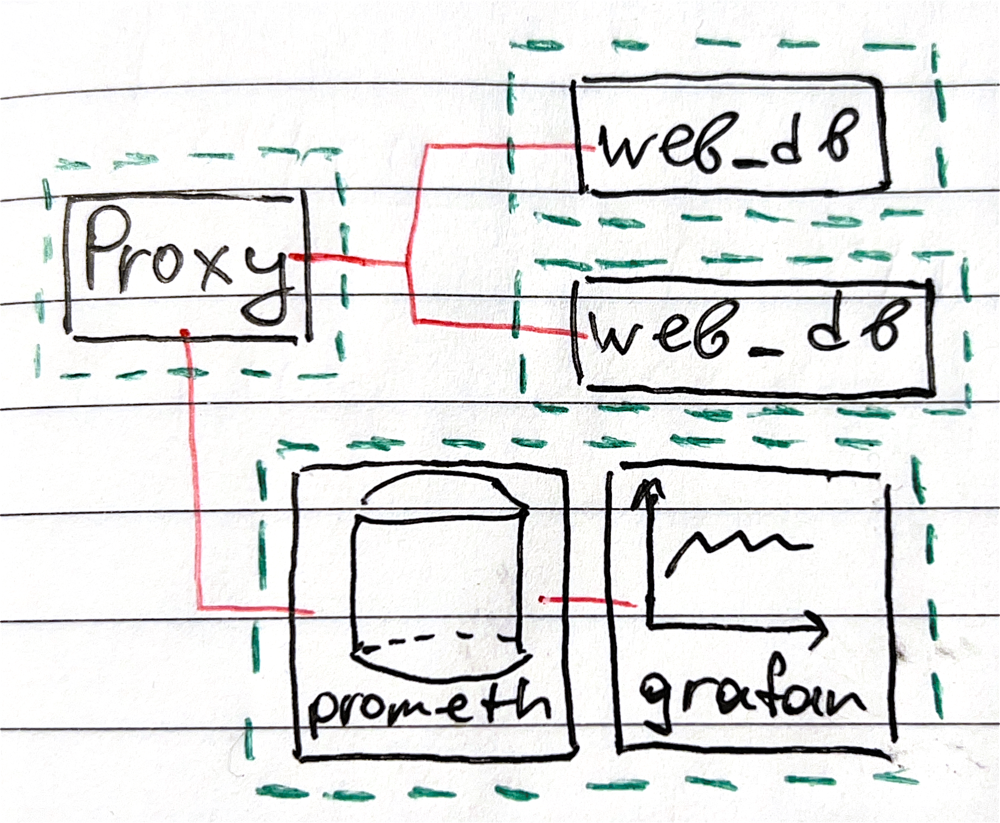

# diploma-experiments

for diploma

## Architecture

https://docs.google.com/spreadsheets/d/191WWNpjJ2za6-nbG4ZoUMXMpUK8KlCIosvQB0f-oq3k/edit#gid=907731238

- https://www.youtube.com/watch?v=ZthWg-_Bg_c&ab_channel=solo.io
  [about metrics logs ... in envoy, prometheus, ...]

### To run _www_, you can do

- ./run.sh

# Description of ports and hosts and urls:

- envoy_host
  - 8080/users: for **incoming and outgoing TRAFFIC**
  - 9901: port for **envoy ADMIN page**
- observability_host(prometheus and grafana)
  - 3000: for **GRAFANA**
    - default email: admin
    - default password: qwerty/admin
  - 9090: for **PROMETHEUS**
